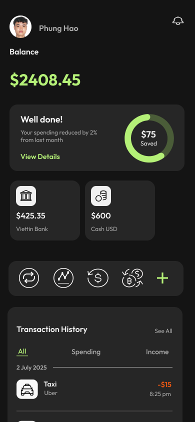
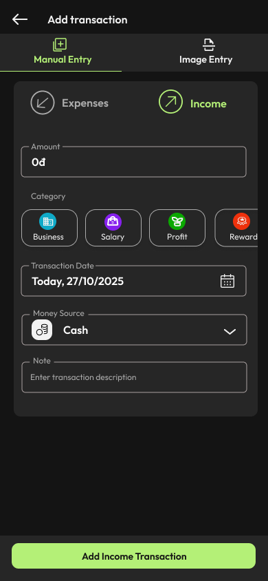
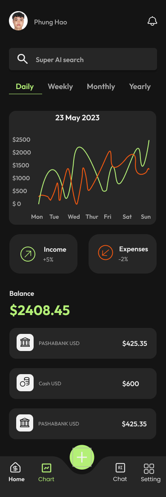
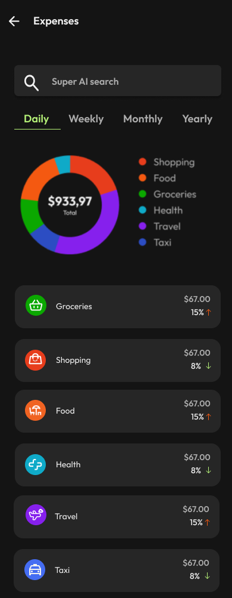

# FinTrack

FinTrack là ứng dụng quản lý tài chính cá nhân đa nền tảng, tập trung vào theo dõi thu chi, quản lý ngân sách và phân tích hành vi chi tiêu theo thời gian thực.

## Kiến trúc & Mẫu thiết kế

Dự án được tổ chức theo **Feature-first + Clean Architecture**:

- `presentation`: UI + State management (`BLoC`)
- `domain`: entities, repository contracts, use cases
- `data`: datasource, models, repository implementations

Luồng phụ thuộc chính:
`UI -> Bloc -> UseCase -> Repository (interface) -> RepositoryImpl -> DataSource (Firebase/API/local)`

Dependency Injection dùng **GetIt** với mô hình đăng ký theo từng feature qua các file `*_injection.dart`, gom tại `lib/core/di/injector.dart`.

## Công nghệ sử dụng

- `flutter_bloc` + `equatable` cho state management
- `get_it` cho dependency injection
- `dartz` cho `Either`/functional error handling ở nhiều module
- `Firebase`:
  - `firebase_core`
  - `firebase_auth` (+ `google_sign_in`)
  - `cloud_firestore`
  - `firebase_storage`
  - `firebase_analytics`
- Networking: `dio`, `http`
- Visualization: `fl_chart`
- Media/Input:
  - `image_picker`
  - `record`
  - `flutter_audio_waveforms`
- Utilities: `intl`, `path`, `path_provider`, `permission_handler`

## Các module chính

- `Auth`: đăng nhập/đăng ký/email-password/google
- `Home`: tổng quan số dư và shortcut tác vụ
- `Add Transaction`: thêm giao dịch thường, quick text, voice, image OCR/AI
- `Money Source`: quản lý ví/tài khoản nguồn tiền
- `Budget`: CRUD ngân sách, cảnh báo và gợi ý
- `Chart`: biểu đồ, tổng hợp nguồn tiền, giao dịch
- `Income` và `Expenses`: phân tích theo danh mục, tìm kiếm
- `Transaction History`: lọc và tìm kiếm lịch sử giao dịch
- `Notifications` + `Monthly Report`
- `Chatbot/AI Chat`

## Cấu trúc thư mục (rút gọn)

```text
lib/
├── core/
│   ├── di/
│   ├── error/
│   ├── services/
│   ├── theme/
│   └── utils/
└── features/
    ├── auth/
    ├── home/
    ├── add_transaction/
    ├── budget/
    ├── chart/
    ├── income/
    ├── expenses/
    ├── transaction_history/
    ├── money_source/
    ├── notifications/
    ├── setting/
    └── chatbot/
```

## Cài đặt và chạy

### Yêu cầu

- Flutter SDK tương thích Dart `^3.8.1`
- Firebase project (Android/iOS/macOS/Web)

### Chạy local

1. Cài dependencies:
   `flutter pub get`
2. Chạy app:
   `flutter run`

## Firebase & tích hợp ngoài

- App khởi tạo Firebase trong `lib/main.dart` bằng `DefaultFirebaseOptions.currentPlatform`.
- Cấu hình hiện có tại `lib/firebase_options.dart` (android/ios/macos/web).
- Một số tính năng AI/report dùng webhook n8n, đang gọi qua:
  - `lib/core/services/n8n_service.dart`
  - `lib/features/add_transaction/add_tx_injection.dart`
  - `lib/features/chatbot/data/datasource/chat_remote_data_source_impl.dart`

## Ảnh giao diện

### Home


### Add Transaction


### Chart


### Expenses


### Transaction History


### AI Screen

